# Trading-GPT
Trading-GPT is a trading bot based on [bbgo](https://github.com/c9s/bbgo) and [langchaingo](https://github.com/tmc/langchaingo).

## Features

- **Natural Language Strategy Writing** - Define trading strategies in plain language without coding
- **Multiple LLM Support** - OpenAI, Google AI, Claude AI, and Ollama
- **Dynamic Technical Indicators** - Query any indicator (RSI, BOLL, SMA, EWMA, etc.) with any timeframe on-demand
- **Limit Orders with Price Expressions** - Dynamic pricing like `last_close * 0.995` for better entry
- **Persistent Memory System** - AI learns from trading experiences across sessions
- **Multi-Timeframe Analysis** - Compare indicators across different timeframes for trend confirmation
- **Risk Management** - Stop loss, take profit, trailing stops, and partial position management
- **External Integrations** - Coze workflows, Fear & Greed Index, Twitter sentiment analysis
- **Chat with Strategy** - Interact with your strategy to refine behavior in real-time

**[Documentation →](docs/)**

## Example
* Moving average strategy
```
Trading strategy: Moving average strategy.
```

* Trend trading Strategies
```
Trading strategy: Trading on the right side, trailing stop loss 3%, trailing stop profit 10%.
```

* MACD divergence strategy
```
Trading strategy: Calculate the MACD indicator based on the K-line. The short period of the MACD indicator is 13, the long period is 34, the moving average period is 9, and the length of the ATR indicator is 13. Open a short order when the MACD indicator is bullish and there is a double top divergence. Open a long order when the MACD indicator is bearish and there is a double bottom divergence. Stop loss 1%, take profit 5%.
```

* BOLL and RSI
```
Trading strategy: This strategy utilizes the Bollinger Bands and RSI indicators, capturing overbought and oversold signals when the stock price reaches the upper and lower Bollinger Bands, confirms the timing by combining with the RSI indicator, and sets stop-loss levels, aiming to profit from both upward and downward cycles.
```

## Architecture

Trading-GPT employs a modular, layered architecture (from bottom to top):

```mermaid
graph BT
    subgraph Layer1["📊 Exchange Layer"]
        Exchanges[Multiple Exchanges<br/>Binance · OKEx · etc.]
    end

    subgraph Layer2["⚙️ Core Engine Layer"]
        BBGO[BBGO Trading Framework]
    end

    subgraph Layer3["🌍 Environment Layer"]
        Exchange[Exchange Entity<br/>Orders · Indicators]
        Coze[Coze Entity<br/>Workflows]
        FNG[FNG Entity<br/>Sentiment]
        Twitter[Twitter Entity<br/>Social Data]
    end

    subgraph Layer4["🤖 AI Layer"]
        TradingAgent[Trading Agent]
        LLM[LLM Manager]
        Memory[Memory System]
    end

    subgraph Layer5["👤 User Layer"]
        Chat[Chat Interface]
        Notify[Notifications]
    end

    Exchanges <--> BBGO
    BBGO --> Exchange
    BBGO --> Coze
    BBGO --> FNG
    BBGO --> Twitter

    Exchange --> TradingAgent
    Coze --> TradingAgent
    FNG --> TradingAgent
    Twitter --> TradingAgent

    LLM --> TradingAgent
    Memory -.-> TradingAgent

    TradingAgent --> Chat
    TradingAgent --> Notify
    Chat --> TradingAgent
```



### Architecture Layers

- **Exchange Layer**: Multiple cryptocurrency exchanges providing market data
- **Core Engine**: BBGO framework handling exchange connections and order execution
- **Environment Layer**: Modular entities for trading, workflows, and data collection
- **AI Layer**: Trading agent powered by LLM with persistent memory
- **User Layer**: Chat interface for input and notifications for updates

## Usage
Prepare your dotenv file .env.local and BBGO yaml config file bbgo.yaml

Config .env.local file
``` bash
# for OKEx exchange, if you have one
OKEX_API_KEY="your okex api key"
OKEX_API_SECRET="your okex api secret"
OKEX_API_PASSPHRASE="your okex api password"

# LLM Google AI
LLM_GOOGLEAI_APIKEY="your googleai api key"

# LLM OpenAI
LLM_OPENAI_TOKEN="your openai api token"

# LLM ANTHROPIC
LLM_ANTHROPIC_TOKEN="your claudeai api token"

```

Config bbgo.yaml file
``` yaml
persistence:
  json:
    directory: "./data/"

sessions:
  okex:
    exchange: okex
    envVarPrefix: okex
    margin: true
    isolatedMargin: false
    isolatedMarginSymbol: SUIUSDT

exchangeStrategies:
- on: okex
  jarvis:
    llm:
      googleai:
        model: "gemini-1.5-pro-latest"
      openai:
        model: "o1-preview"
        no_system_role: true
      anthropic:
        model: "claude-3-opus-20240229"
      ollama:
        server_url: "http://localhost:11434"
        model: "codegemma:7b"
      primary: "openai"
      secondly: "anthropic"
    env:
      exchange:
        indicators:
          MA5:
            type: "sma"
            params:
              interval: "5m"
              window_size: "5"
          MA20:
            type: "sma"
            params:
              interval: "5m"
              window_size: "20"
      include_events:
        - kline_changed
        - indicator_changed
        - fng_changed
        - position_changed
        - update_finish
    agent:
      trading:
        enabled: true
        name: "Trading AI"
        temperature: 1
        max_context_length: 4096
        backgroup: "I want you to act as an trading assistant. The trading assistant supports registering entities, analyzes market data provided by entities, and generates entity control commands. After receiving the command, the entity will report the result of the command execution. The goal of the transaction assistant is: to maximize returns by generating entity control commands."
    notify:
      feishu_hook:
        enabled: true
        url: "your feishu group custom webhook url"
    symbol: SUIUSDT
    interval: 15m
    leverage: 1
    max_num: 20
    strategy: "Trading on the right side, trailing stop loss 3%, trailing stop profit 10%."
```

Run
``` bash
docker run --name trading-ai -d -v ${PWD}:/strategy yubing744/trading-gpt:latest run
```
