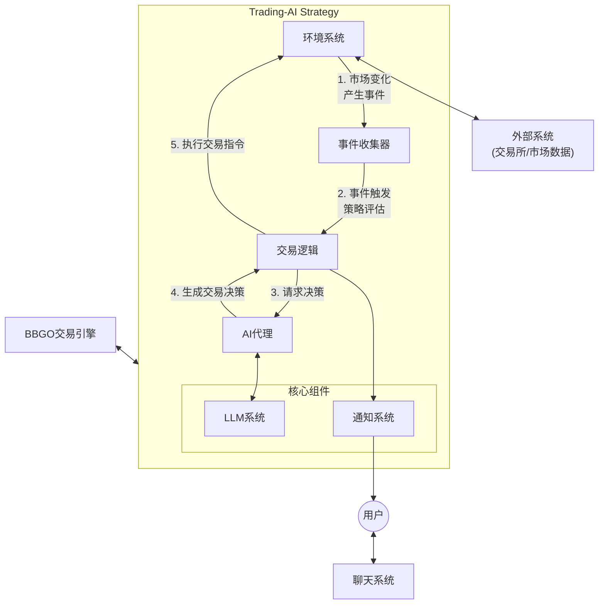
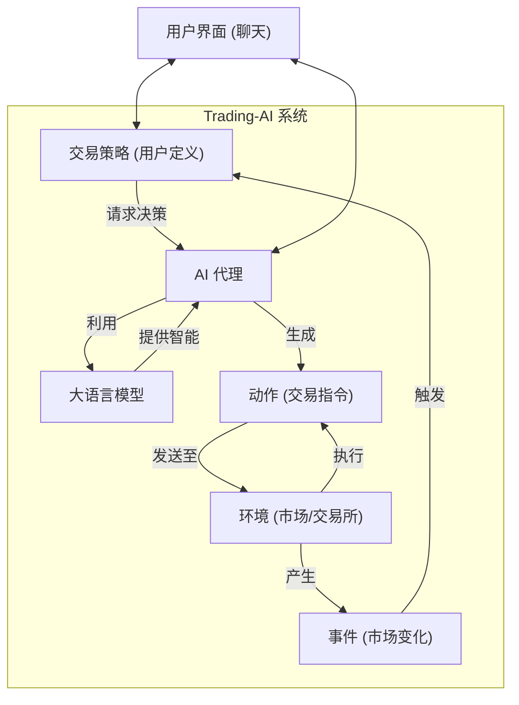
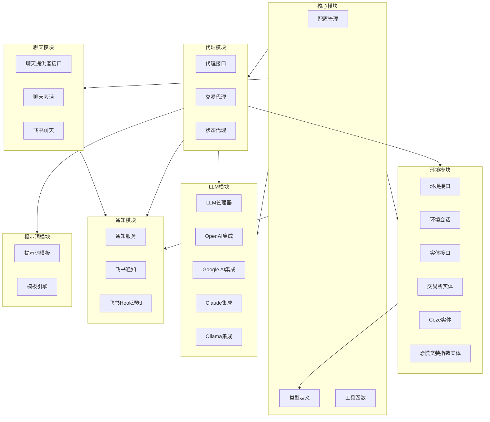

# Trading-AI 技术方案文档

## 1. 需求描述

### 1.1 项目背景

Trading-AI 是一个创新型交易机器人项目，基于 [bbgo](https://github.com/c9s/bbgo) 交易引擎和 [langchaingo](https://github.com/tmc/langchaingo) 语言模型集成框架构建。该项目旨在通过自然语言接口降低算法交易的门槛，使不具备编程技能的交易者也能创建和管理自动化交易策略。

### 1.2 核心需求

1. **自然语言交易策略**：用户能够使用自然语言描述交易策略，系统将其转换为可执行的交易逻辑。
2. **多LLM支持**：支持多种大语言模型，包括 OpenAI、Google AI、Claude AI 和 Ollama。
3. **风险管理**：支持设置止损和止盈参数，确保交易策略的风险可控。
4. **策略交互**：用户可以与策略进行对话，调整或了解策略的行为。
5. **技术指标支持**：支持多种技术指标，如MACD、RSI、布林带等。
6. **多交易所支持**：通过bbgo引擎支持多个加密货币交易所。
7. **通知系统**：提供交易更新和系统状态的通知功能。

### 1.3 项目目标

1. 创建一个稳健、可靠的交易系统，能够执行用自然语言定义的策略
2. 支持多个交易所和交易对
3. 提供全面的反馈和监控功能
4. 确保系统安全性，配备适当的风险管理功能

### 1.4 项目范围

- 初期聚焦于加密货币交易
- 保持与bbgo现有功能的兼容性
- 优先考虑可靠性和安全性，而非功能扩展

## 2. 需求分析

### 2.1 角色分析

#### 2.1.1 用户角色

1. **策略创建者**
   - **特点**：了解交易市场和策略，但可能缺乏编程技能
   - **需求**：希望使用自然语言创建和部署交易策略
   - **预期行为**：描述交易思路，设置风险参数，监控策略执行情况

2. **系统管理员**
   - **特点**：负责系统配置和维护
   - **需求**：需要监控系统健康状态，管理API密钥和配置
   - **预期行为**：配置系统参数，监控系统日志，处理异常情况

3. **交易分析师**
   - **特点**：专注于交易策略优化
   - **需求**：分析策略执行效果，调整策略参数
   - **预期行为**：查看交易记录，分析策略表现，提出改进建议

#### 2.1.2 系统角色

1. **Trading Agent**
   - **职责**：处理自然语言策略，生成交易动作
   - **交互对象**：用户，LLM，交易所

2. **Keeper Agent**
   - **职责**：维护系统状态，协调系统组件
   - **交互对象**：Trading Agent，环境系统

3. **LLM Manager**
   - **职责**：管理与LLM的通信，提供模型选择
   - **交互对象**：各类LLM提供商API

4. **环境系统**
   - **职责**：与外部系统接口，如交易所、市场数据源
   - **交互对象**：交易所API，市场数据源

5. **通知系统**
   - **职责**：向用户提供系统状态和交易更新
   - **交互对象**：用户，通知渠道

### 2.2 用例分析

#### 2.2.1 核心用例

1. **创建交易策略**
   - **参与者**：策略创建者，Trading Agent，LLM Manager
   - **前置条件**：用户已配置交易所API和LLM访问权限
   - **主要流程**：
     1. 用户用自然语言描述交易策略
     2. Trading Agent使用LLM解释策略
     3. 系统询问用户可能的澄清问题
     4. 系统创建可执行的交易逻辑
     5. 用户确认策略参数
     6. 系统部署策略
   - **后置条件**：交易策略被创建并准备执行
   - **异常流程**：
     1. LLM无法理解策略：系统请求用户重新描述或提供更多细节
     2. 参数无效：系统提示用户调整参数

2. **执行交易策略**
   - **参与者**：Trading Agent，环境系统
   - **前置条件**：交易策略已创建
   - **主要流程**：
     1. 系统监控市场条件
     2. 当满足策略条件时，生成交易动作
     3. 环境系统执行交易动作
     4. 系统记录交易结果
     5. 通知系统向用户发送交易更新
   - **后置条件**：交易执行完成，结果被记录
   - **异常流程**：
     1. 交易失败：系统记录错误，通知用户
     2. 市场条件变化：系统根据策略调整行为

3. **调整交易策略**
   - **参与者**：策略创建者，Trading Agent，LLM Manager
   - **前置条件**：交易策略已在执行中
   - **主要流程**：
     1. 用户通过聊天描述调整需求
     2. Trading Agent使用LLM理解调整内容
     3. 系统预览调整效果
     4. 用户确认调整
     5. 系统更新策略
   - **后置条件**：交易策略被更新
   - **异常流程**：
     1. 调整不兼容：系统解释问题并提供替代方案
     2. LLM无法理解调整：系统请求更清晰的说明

#### 2.2.2 辅助用例

1. **监控系统状态**
   - **参与者**：系统管理员，Keeper Agent
   - **主要流程**：
     1. Keeper Agent收集系统状态信息
     2. 系统生成状态报告
     3. 通知系统向管理员提供报告

2. **分析交易绩效**
   - **参与者**：交易分析师，Trading Agent
   - **主要流程**：
     1. 用户请求特定时间段的交易分析
     2. 系统收集交易数据
     3. Trading Agent使用LLM生成分析报告
     4. 系统呈现分析结果

## 3. 概要设计

### 3.1 系统架构图

系统采用事件驱动的架构设计，主要由以下关键部分组成：

1. **环境系统**：作为交易应用与外部世界(交易所、市场数据)的接口层，负责：
   - 监听市场数据变化
   - 接收交易指令并执行
   - 产生反映外部状态变化的事件

2. **事件收集器**：收集环境系统产生的各类事件，包括：
   - K线数据更新
   - 市场指标变化
   - 持仓状态变更
   - 恐慌贪婪指数变化

3. **交易逻辑**：核心决策层，负责：
   - 根据收集的事件评估当前市场状况
   - 决定何时需要AI代理参与决策
   - 协调交易执行和风险管理

4. **AI代理**：交易决策的智能中枢，负责：
   - 分析市场数据和用户意图
   - 通过自然语言理解用户策略
   - 生成具体交易决策和行动

5. **LLM系统**：AI代理的核心能力提供者，负责：
   - 自然语言理解和生成
   - 策略解析和转换
   - 支持多种LLM模型选择

6. **通知系统**：用户反馈渠道，负责：
   - 交易执行结果通知
   - 系统状态更新
   - 策略执行情况报告

### 3.2 领域模型

领域模型描述了 Trading-AI 系统的核心概念及其相互作用，构成了系统业务逻辑的基础。

**核心领域对象说明:**

1.  **交易策略 (Strategy)**:
    *   代表用户定义的交易逻辑和规则，通常通过自然语言输入。
    *   是系统决策的核心依据，消费市场事件并决定何时需要AI代理介入。

2.  **环境 (Environment)**:
    *   代表外部世界，主要是指交易所和市场数据源。
    *   负责监听外部变化（如价格、指标），产生相应的**事件**。
    *   负责执行由**AI代理**生成的**动作**（如买入/卖出）。

3.  **事件 (Event)**:
    *   代表环境中发生的变化，如K线更新、订单成交、指标变化等。
    *   是驱动**交易策略**进行评估和决策的触发器。

4.  **AI 代理 (Agent)**:
    *   系统的智能核心，负责解释**交易策略**和市场**事件**。
    *   利用**大语言模型 (LLM)** 的能力来理解上下文、用户意图，并生成交易**动作**。

5.  **大语言模型 (LLM)**:
    *   为**AI代理**提供自然语言理解、生成和推理能力。
    *   帮助解析用户输入的策略描述，并根据当前市场情况生成决策建议。

6.  **动作 (Action)**:
    *   代表**AI代理**生成的具体指令，通常是交易指令（如买入、卖出、设置止损）。
    *   由**环境**负责执行。

**核心交互流程:**

1.  **环境**监测到市场变化，产生**事件**。
2.  **事件**触发**交易策略**的评估逻辑。
3.  **交易策略**根据当前状态和事件信息，决定何时向**AI代理**请求决策。
4.  **AI代理**结合策略要求、当前事件和历史上下文，利用**LLM**进行分析和推理。
5.  **AI代理**生成具体的交易**动作**。
6.  **动作**被发送到**环境**中执行（例如，在交易所下单）。
7.  用户可以通过用户界面与**交易策略**和**AI代理**进行交互。

这个领域模型更清晰地展示了系统各核心概念之间的业务逻辑关系和信息流转，突出了事件驱动和AI决策的核心特点。

### 3.3 模块图

模块图展示了系统的分层架构和功能模块划分，清晰地呈现各模块间的依赖关系和系统的整体结构。该架构设计遵循了关注点分离原则，确保了系统各部分的独立性和可维护性。

模块图说明：

1. **核心模块（Core）**：
   - 为整个系统提供基础设施和共享功能
   - `Config`负责整个系统的配置管理，支持环境变量和配置文件的加载
   - `Types`定义了系统中使用的核心数据类型和接口
   - `Utils`提供了各类通用工具函数，如字符串处理、风险管理计算等

2. **代理模块（Agents）**：
   - 实现了系统的智能决策能力
   - `AgentI`定义了代理的接口规范
   - `Trading`实现了交易策略的解析和执行
   - `Keeper`负责系统状态的维护和监控

3. **环境模块（Env）**：
   - 提供了与外部系统交互的抽象层
   - `EnvI`和`Entity`定义了环境和实体的接口规范
   - `EnvSession`管理环境的会话状态
   - 包含多种实体实现，如`Exchange`、`Coze`和`FNG`等

4. **LLM模块（LLMs）**：
   - 提供了大语言模型的集成和管理
   - `LLMManager`统一管理不同的LLM提供商
   - 支持多种LLM实现，包括OpenAI、GoogleAI、Claude和Ollama
   - 提供了统一的模型访问接口

5. **聊天模块（Chat）**：
   - 实现了用户与系统的交互界面
   - `ChatProvider`定义了聊天提供者的接口规范
   - `ChatSession`管理用户的会话状态
   - 目前支持飞书作为聊天渠道

6. **通知模块（Notify）**：
   - 负责向用户推送系统状态和交易更新
   - `NotifyService`提供了统一的通知服务
   - 支持多种通知渠道，如飞书和飞书Hook

7. **提示词模块（Prompt）**：
   - 管理与LLM交互的提示词模板
   - `PromptTemplate`提供了标准化的提示词结构
   - `XTemplate`实现了模板渲染引擎

8. **模块依赖关系**：
   - 核心模块被所有其他模块依赖，提供基础能力
   - 代理模块依赖LLM、环境、提示词和通知模块，体现了其核心协调角色
   - 聊天模块依赖通知模块实现消息推送
   - 环境模块依赖核心类型定义，确保数据结构一致性

### 3.4 技术挑战

1. **自然语言理解的准确性**
   - **挑战**：确保LLM准确理解用户描述的交易策略
   - **解决方案**：
     - 使用结构化提示词模板
     - 实施澄清机制，在不确定时向用户提问
     - 支持多种LLM以提高理解的可靠性

2. **交易策略执行的安全性**
   - **挑战**：防止生成和执行有风险的交易策略
   - **解决方案**：
     - 实施风险管理约束（如止损和止盈）
     - 在执行交易前进行安全检查
     - 设置交易限额防止过度交易

3. **系统状态管理**
   - **挑战**：在分布式环境中维护一致的系统状态
   - **解决方案**：
     - 使用Keeper Agent监控和协调系统组件
     - 实施事件驱动架构，确保状态变更的一致传播
     - 使用环境会话管理状态和生命周期

4. **交易所API的可靠集成**
   - **挑战**：处理交易所API的限制和特性差异
   - **解决方案**：
     - 利用bbgo的交易引擎抽象不同交易所API
     - 实施重试机制和错误处理
     - 设计环境实体层以标准化交互

5. **LLM上下文限制**
   - **挑战**：处理复杂策略描述可能超出LLM上下文限制
   - **解决方案**：
     - 实现策略分解机制，将复杂策略分解为可管理的部分
     - 使用模板优化提示词结构
     - 探索不同LLM提供商的上下文容量权衡

## 4. 详细设计 (Detailed Design)

### 4.1 记忆功能 (Memory Feature)

#### 4.1.1 功能概述

为了让 Trading-AI 具备学习和迭代能力，系统提供基于文件的记忆功能。记忆系统在每个交易决策周期中工作，AI 通过 `thoughts.reflection` 字段进行自我反思，并通过 `memory.content` 字段维护持久化的记忆内容。记忆内容存储在 `memory-bank/trading-memory.md` 文件中，在策略运行周期重置时，AI 完全依赖此记忆文件来理解项目状态和持续工作。

**Note**: 之前的 TradeReflection 功能（在仓位关闭时自动生成独立反思文件）已被移除，因其与 Memory 系统功能重叠。现在所有反思和学习都通过统一的 Memory 系统完成。

#### 4.1.2 仓位关闭事件处理

当交易仓位关闭时，系统会触发 `PositionClosedEvent` 事件。`pkg/jarvis.go` 中的 `handlePositionClosed()` 函数负责处理此事件：

1. **通知用户**: 发送仓位关闭通知，包含盈亏信息
2. **记录到会话**: 将仓位数据存储到会话属性中供后续使用
3. **添加消息**: 向消息队列添加仓位关闭摘要信息

AI 可以在后续的决策周期中通过 Memory 系统记录和学习这些交易经验。

#### 4.1.3 Memory 系统工作流程

Memory 系统在每个决策周期中工作：

1. **加载记忆**: `pkg/jarvis.go` 从 `memory-bank/trading-memory.md` 加载现有记忆
2. **构建提示词**: 将记忆内容整合到 AI 提示词中
3. **AI 决策**: AI 分析市场数据、仓位信息和历史记忆，生成决策
4. **反思输出**: AI 通过 `thoughts.reflection` 字段输出当前周期的反思
5. **更新记忆**: AI 通过 `memory.content` 字段输出更新后的完整记忆内容
6. **保存记忆**: 系统将更新后的记忆保存到文件中

#### 4.1.4 组件和配置

*   **`pkg/jarvis.go`**:
    *   实现记忆加载逻辑 (`setupMemory()`)
    *   处理 AI 的记忆输出 (`processMemoryOutput()`)
    *   管理记忆字数限制和截断
*   **`pkg/memory/memory_manager.go`**:
    *   提供记忆文件的读写操作
    *   实施字数限制和验证
*   **`pkg/types/result.go`**: 定义 `Memory` 结构体
*   **`pkg/prompt/prompt.go`**: 包含记忆相关的提示词模板
*   **`pkg/config/config.go`**:
    *   `memory.enabled`: 启用/禁用记忆功能
    *   `memory.memory_path`: 记忆文件存储路径，默认为 `"memory-bank/trading-memory.md"`
    *   `memory.max_words`: 记忆字数上限，默认为 `1000`

#### 4.1.5 技术考虑

*   **字数限制**: 通过 `max_words` 配置项限制记忆大小，防止无限增长
*   **周期重置**: 策略周期重置时 AI 的上下文清空，完全依赖记忆文件
*   **错误处理**: 文件读写失败时记录日志并提供用户反馈
*   **并发安全**: 当前实现为单实例，多实例并发需要额外的文件锁机制
